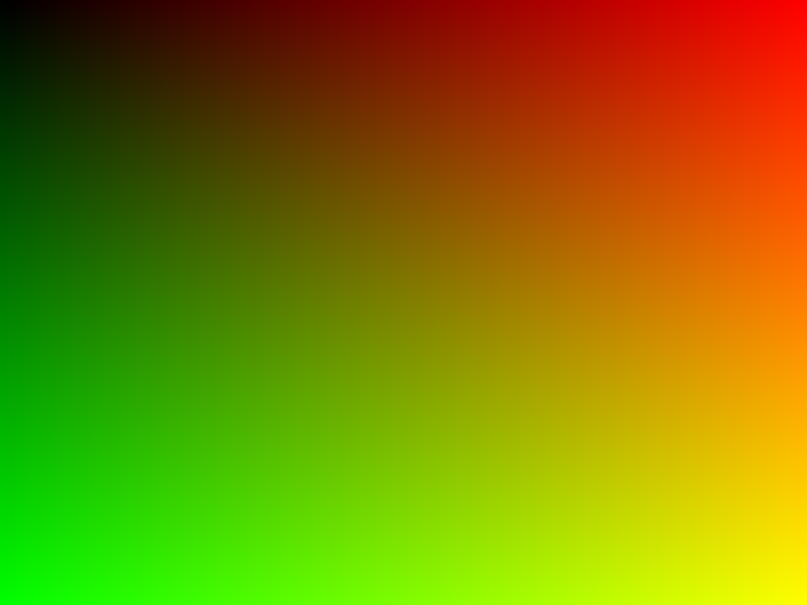

# gotinyraytracer

`gotinyraytracer` is a tiny ray tracer modeled after
https://github.com/ssloy/tinyraytracer but written in Go. It ie meant
to be a learning exercise and its development is captured in [a series of blog
posts](https://codegoalie.com/2019/01/21/ray-tracing-pt-1/index.html).

By commit, the expected output images are:

__Step 1__

